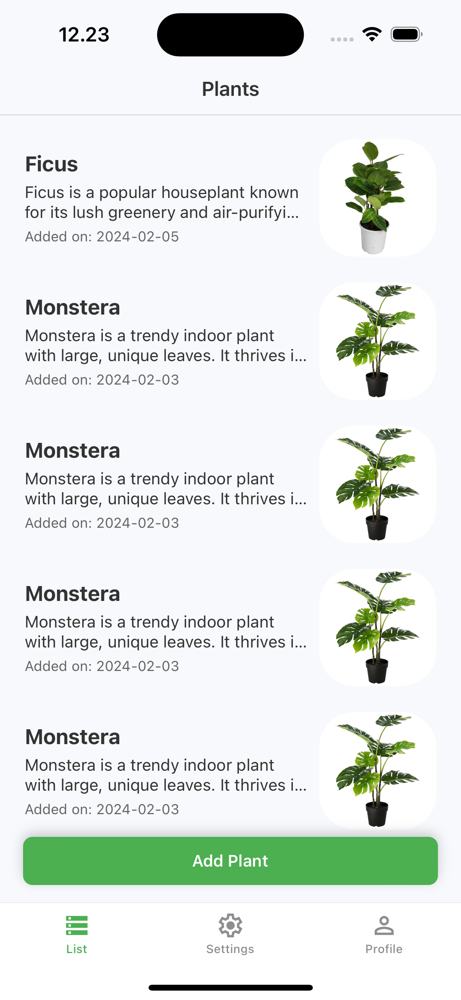
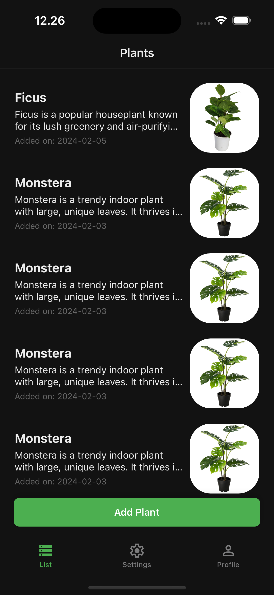
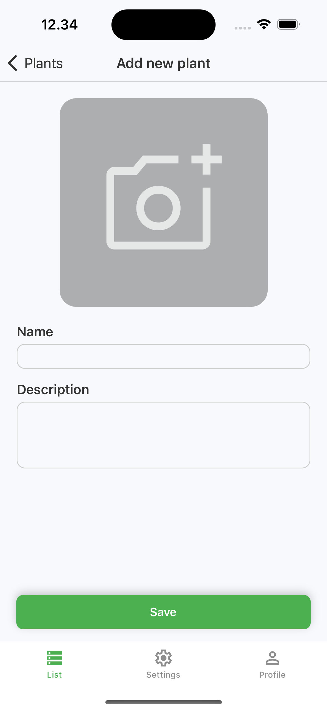
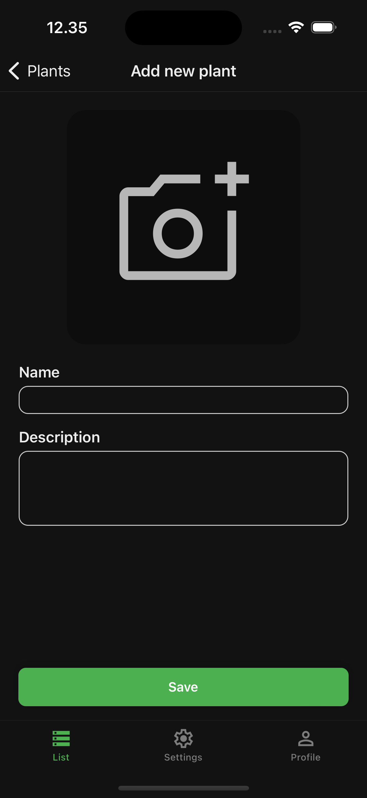
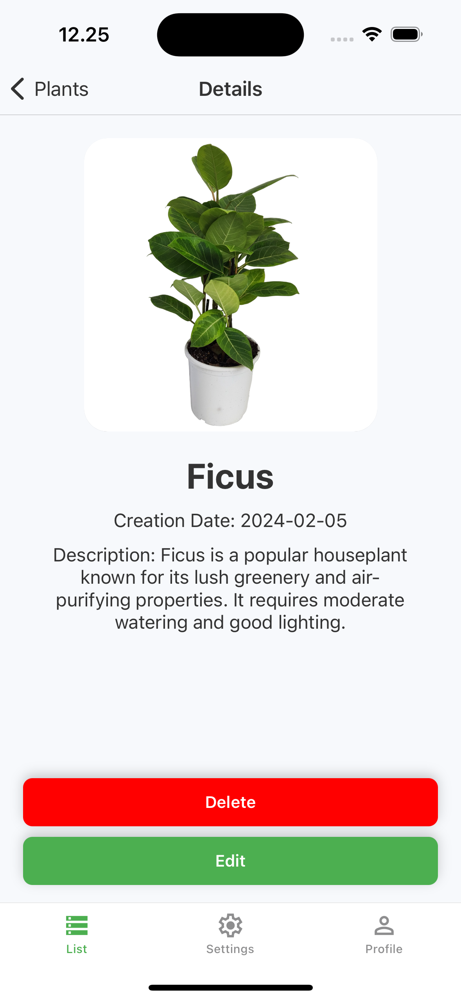
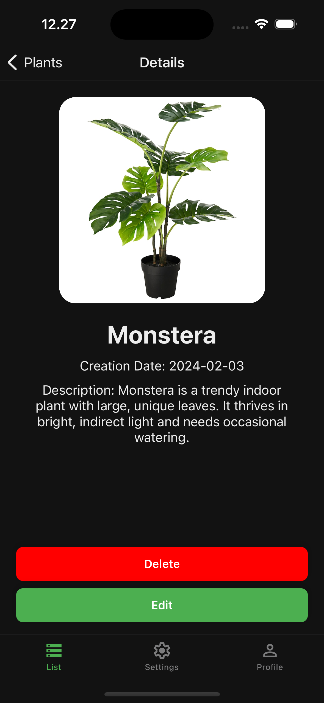
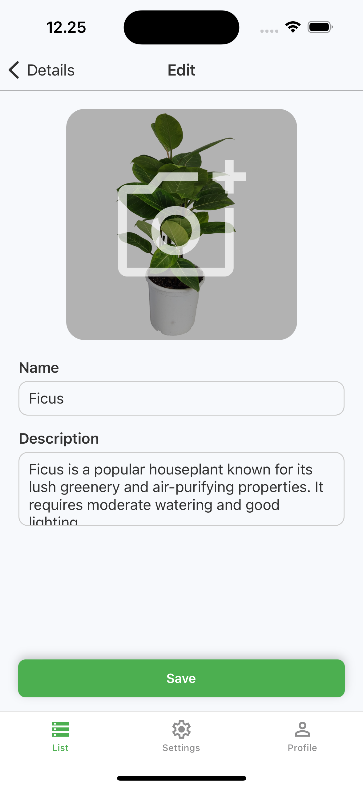
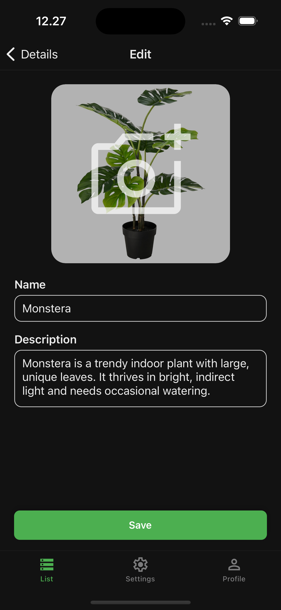

# Nocfo test project

## Overview

This is a **React Native** mobile application built with **Expo**. It includes:

This React Native mobile application, built with Expo, provides functionality to save, view, and manage plant photos. The app consists of three main navigation tabs:

- List View (fully functional): Displays all saved plants with their names and dates added. Users can add a new plant or select an existing one to view its details.
- Scan View (fully functional): Allows users to add a new plant by capturing a photo/chose from galery and entering a name and description.
- Detail View: Shows detailed information about the selected plant, including its photo, name, and description. Users can edit the plant details or delete it entirely.
- Edit View (fully functional): Allows user to modify the plant's information through the simple form.
- Settings Tab Screen (placeholder): Contains three buttons that might lead to different views.
- Profile Screen (placeholder): Displays basic user information.

  #### Features

- Light and Dark mode support
- Redux state management for seamless data handling and local storage functionality

## Screenshots

Here are some screenshots of the app:

### List View

 

### Scan View

 

### Detail View

 

### Edit View

 

## Getting Started

### Prerequisites

Before running the project, make sure you have the following installed:

- **Node.js** (Download from [nodejs.org](https://nodejs.org/))
- **npm** (Comes with Node.js) or **yarn**
- **Expo CLI** (Install globally if not already installed):
  ```sh
  npm install -g expo-cli
  ```

### Clone the Repository

```sh
git clone https://github.com/AntBezr/nocfoTest.git
cd nocfoTest
```

### Install Dependencies

```sh
npm install
# or using yarn
yarn install
```

### Run the Project

To start the development server, use:

```sh
npx expo start -c
```

This will open an Expo developer interface in your terminal.

### Run on a Device or Emulator

Running on a physical device

- Install the Expo Go app from the Google Play Store or Apple App Store.
- Scan the QR code shown in the terminal or the Expo Developer Interface.

Running on an emulator (Android)

- Install Android Studio and set up an emulator.
- Ensure the emulator is running before starting the project.
- Run:

```sh
npx expo start --android
```

Running on an iOS simulator

- Install Xcode (Mac only).
- Run:

```sh
npx expo start --ios
```

### Technologies Used

- React Native
- Expo
- Redux for state management
